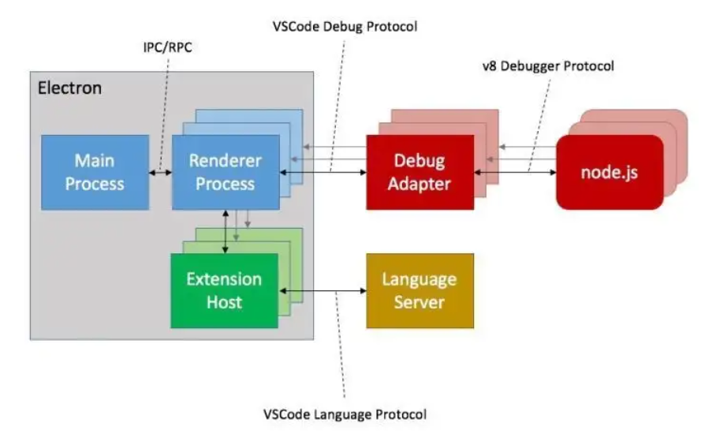

# Khakimov Ruslan M33011
## Плагины в VS Code

- `Extension Host` - отдельный процесс, в котором работают все расширения. Всё взаимодействие с остальными процессами VS Code'а происходит через API посредством IPC.



Для написания расширений VS Code'а необходимо понимать три понятия:
- `Activation Event` -- когда запустить расширение.
- `Contribution Point` -- присвоить кастомной команде id и сделать доступной для выполнения.
- `VS Code API` -- привязать функцию обработчик к команде.

## SafeInclude

Плагин для генерации защиты от повторного включения.

- Команда `Set up safe include` для применения к существующему файлу.
- Автоматическое применение при создании новых файлов с расширением -- `.h, .hpp, .h++, .hh`

----------

```c++
#include <cmath>

int foo(int a) {
    return pow(2, a);
}
```

----------

- `Ctrl + Shift + P` 
- `Set up safe include`

----------

```c++
#ifndef F38E4ECC_97F2_41C9_82B9_0A4518582950
#define F38E4ECC_97F2_41C9_82B9_0A4518582950

#include <cmath>

int foo(int a) {
    return pow(2, a);
}

#endif /* F38E4ECC_97F2_41C9_82B9_0A4518582950 */
```

----------

## Future work

- Автоматическое обновление макросов плагина при перемещении файла.
- Команда для удаления макросов плагина.
- Команда для обновления макросов плагина.
- Более осмысленные идентификатор.